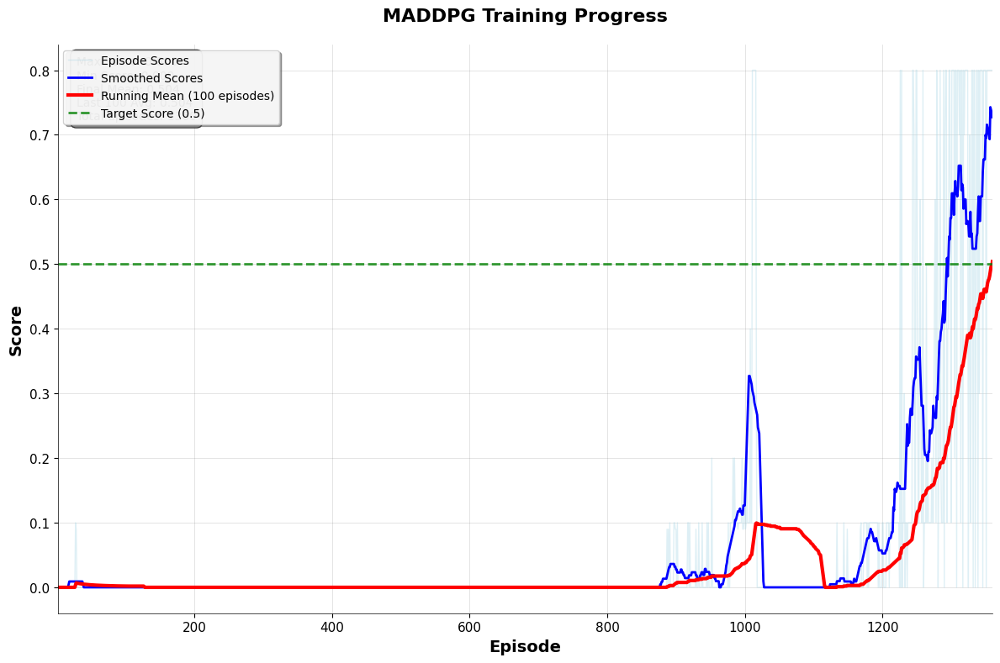

# Multi-Agent Deep Deterministic Policy Gradient (MADDPG)

## Project Overview

This project implements a Multi-Agent Deep Deterministic Policy Gradient (MADDPG) algorithm to train two agents to play tennis collaboratively. The agents learn to keep a ball in play by hitting it over a net, demonstrating emergent cooperative behavior through continuous action control.

### Environment Details

**Goal**: Train two tennis players to bounce a ball over a net for as many time steps as possible, achieving an average score of +0.5 over 100 consecutive episodes.

**Reward Structure**:
- +0.1 for each step that an agent hits the ball over the net
- -0.01 if an agent lets the ball hit the ground or hits it out of bounds

**State Space**: 
- 8 variables per agent corresponding to position and velocity of ball and racket
- Each agent receives its own local observation
- Total observation space: 24 dimensions (8 × 3 observations per agent)

**Action Space**:
- 2 continuous actions per agent
- Movement toward/away from the net
- Jumping

**Success Criteria**: The environment is considered solved when the agents achieve an average score of +0.5 over 100 consecutive episodes.

## Algorithm Implementation

### Multi-Agent Deep Deterministic Policy Gradient (MADDPG)

MADDPG extends the DDPG algorithm to multi-agent environments by using:
- **Centralized Training**: Agents share experiences during learning
- **Decentralized Execution**: Each agent acts independently using its own policy
- **Actor-Critic Architecture**: Each agent maintains both policy (actor) and value (critic) networks

### Key Components

#### Agent Architecture (`maddpg_agent.py`)
- Single agent managing multiple environment entities
- Shared experience replay buffer for all agents
- Ornstein-Uhlenbeck noise process for exploration
- Soft target network updates for training stability

#### Neural Network Models (`model.py`)

**Actor Network (Policy)**:
- Input: State (24 dimensions)
- Hidden Layers: 100 → 75 → 75 nodes
- Activation: ReLU (with batch normalization on first layer)
- Output: 2 continuous actions (tanh activation, bounded [-1, 1])

**Critic Network (Value Function)**:
- Input: State (24 dimensions) + Actions (4 dimensions from both agents)
- Hidden Layers: 100 → 100 nodes
- Activation: ReLU (with batch normalization on first layer)
- Output: Single Q-value (no activation)
- Architecture: Late fusion (state processed first, then concatenated with actions)

### Training Process

1. **Environment Reset**: Initialize episode with random starting positions
2. **Action Selection**: Each agent selects actions using current policy + exploration noise
3. **Environment Step**: Execute actions and observe rewards, next states, and done signals
4. **Experience Storage**: Store transitions in shared replay buffer
5. **Learning**: Sample mini-batches and update actor-critic networks
6. **Target Network Updates**: Soft updates to target networks for stability

## Hyperparameters

```python
BUFFER_SIZE = 100,000      # Replay buffer size
BATCH_SIZE = 128           # Mini-batch size
GAMMA = 0.99              # Discount factor
TAU = 1e-3                # Soft update parameter
LR_ACTOR = 1e-4           # Actor learning rate
LR_CRITIC = 1e-3          # Critic learning rate
WEIGHT_DECAY = 0          # L2 weight decay
```

## Results

The agent successfully solved the environment in **1,260 episodes**, achieving an average score of +0.5040 over 100 consecutive episodes at episode 1,360.

### Training Performance



*Figure: Episode scores (blue), smoothed scores (dark blue), and running mean over 100 episodes (red). The green dashed line indicates the target score of 0.5.*

### Training Progress Milestones
- **Episodes 1-800**: Initial exploration phase with minimal learning (≈0.000 average)
- **Episode 900**: First signs of learning (0.0066 average)
- **Episode 1000**: Steady improvement begins (0.0376 average)
- **Episode 1100**: Learning accelerates (0.0639 average)
- **Episode 1300**: Breakthrough performance (0.2480 average)
- **Episode 1360**: **Environment solved!** (0.5040 average)

### Analysis of Training Results

**Characteristic Learning Pattern**: The training exhibited a typical multi-agent learning curve with three distinct phases:

1. **Exploration Phase (Episodes 1-800)**: Extended period of minimal rewards as agents learn basic environment dynamics
2. **Learning Phase (Episodes 900-1200)**: Gradual improvement as agents discover cooperative strategies  
3. **Breakthrough Phase (Episodes 1300+)**: Rapid convergence once effective collaboration emerges

**Why MADDPG Took Time to Learn**:
- **Multi-agent complexity**: Two agents must learn to coordinate actions simultaneously
- **Sparse rewards**: Tennis environment provides limited positive feedback initially
- **Continuous action space**: More challenging than discrete actions
- **Cooperative requirement**: Both agents must perform well for sustained rallies

The final breakthrough at episode 1300 (jumping from 0.0258 to 0.2480) demonstrates the sudden emergence of cooperative behavior typical in multi-agent reinforcement learning.

## File Structure

```
├── maddpg_agent.py          # Main agent implementation
├── model.py                 # Neural network architectures
├── Tennis.ipynb             # Training notebook
├── checkpoint_actor.pth     # Trained actor weights
├── checkpoint_critic.pth    # Trained critic weights
└── README.md               # This file
```

## Usage

### Training
```python
from maddpg_agent import Agent

# Initialize agent
agent = Agent(state_size=24, action_size=2, num_agents=2, random_seed=42)

# Training loop
for episode in range(max_episodes):
    states = env.reset()
    scores = np.zeros(num_agents)
    
    while True:
        actions = agent.act(states, add_noise=True)
        next_states, rewards, dones = env.step(actions)
        agent.step(states, actions, rewards, next_states, dones)
        
        states = next_states
        scores += rewards
        
        if np.any(dones):
            break
```

### Testing
```python
# Load trained weights
agent.load_checkpoint('checkpoint_actor.pth')

# Test performance
for episode in range(test_episodes):
    states = env.reset()
    scores = np.zeros(num_agents)
    
    while True:
        actions = agent.act(states, add_noise=False)  # No exploration
        next_states, rewards, dones = env.step(actions)
        
        states = next_states
        scores += rewards
        
        if np.any(dones):
            break
```

## Key Features

### Enhanced Implementation
- **Type Hints**: Full type annotations for better code clarity
- **Configuration Management**: Centralized hyperparameter control
- **Error Handling**: Robust CUDA tensor management
- **Modular Design**: Clean separation of concerns
- **Checkpointing**: Save/load model states for reproducibility

### Algorithm Improvements
- **Proper Weight Initialization**: Xavier initialization for stable training
- **Gradient Clipping**: Prevents exploding gradients
- **Batch Normalization**: Improved training stability
- **Exploration Decay**: Noise reduction over time for better convergence

## Future Work

### Potential Improvements
1. **Prioritized Experience Replay (PER)**: Focus learning on important experiences
2. **Multi-Agent PPO (MAPPO)**: Alternative policy gradient approach
3. **Hyperparameter Tuning**: Systematic optimization of learning parameters
4. **Network Architecture**: Experiment with deeper networks or attention mechanisms
5. **Curriculum Learning**: Progressive difficulty increase during training

### Research Directions
- **Communication Protocols**: Explicit agent-to-agent communication
- **Hierarchical Multi-Agent RL**: Decompose complex tasks into subtasks
- **Transfer Learning**: Apply learned policies to new multi-agent environments
- **Robustness Testing**: Evaluate performance under various conditions

## Dependencies

- Python 3.6+
- PyTorch 1.0+
- NumPy
- Matplotlib
- Unity ML-Agents

## References

1. [Multi-Agent Actor-Critic for Mixed Cooperative-Competitive Environments](https://arxiv.org/abs/1706.02275)
2. [Continuous Control with Deep Reinforcement Learning](https://arxiv.org/abs/1509.02971)
3. [Unity ML-Agents Toolkit](https://github.com/Unity-Technologies/ml-agents)

---

*This implementation demonstrates the power of multi-agent reinforcement learning in continuous control tasks, showing how independent agents can learn to cooperate through shared experience and decentralized execution.*
